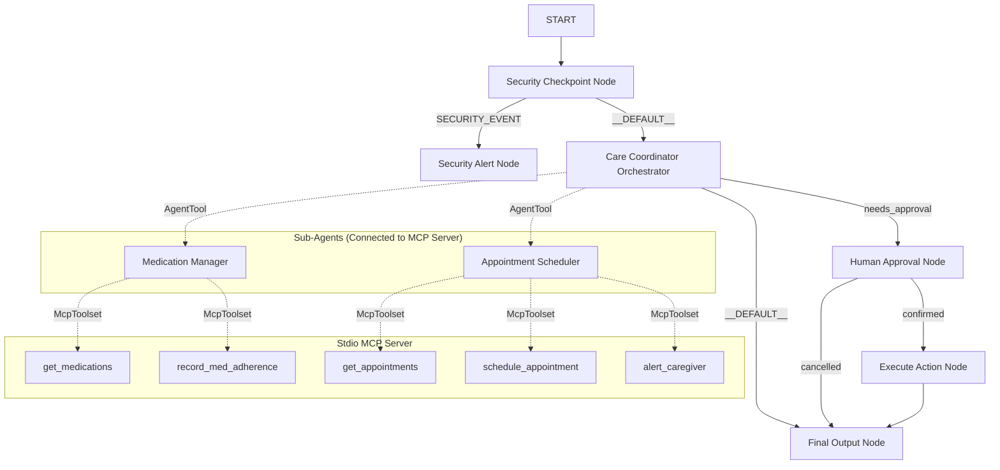

## Architecture Diagram

```mermaid
graph TD
    START[START] --> SecCheck[Security Checkpoint Node]
    SecCheck -- SECURITY_EVENT --> SecAlert[Security Alert Node]
    SecCheck -- __DEFAULT__ --> Orchestrator[Care Coordinator Orchestrator]
    
    Orchestrator -- needs_approval --> HITL[Human Approval Node]
    Orchestrator -- __DEFAULT__ --> Final[Final Output Node]
    
    HITL -- confirmed --> ExecAction[Execute Action Node]
    HITL -- cancelled --> Final
    
    ExecAction --> Final
    
    subgraph SA["Sub-Agents (Connected to MCP Server)"]
        MedMgr[Medication Manager]
        ApptSch[Appointment Scheduler]
    end
    
    Orchestrator -. AgentTool .-> MedMgr
    Orchestrator -. AgentTool .-> ApptSch
    
    subgraph MCP["Stdio MCP Server"]
        get_meds[get_medications]
        log_med[record_med_adherence]
        get_appts[get_appointments]
        sch_appt[schedule_appointment]
        alert_cg[alert_caregiver]
    end
    
    MedMgr -. McpToolset .-> get_meds
    MedMgr -. McpToolset .-> log_med
    ApptSch -. McpToolset .-> get_appts
    ApptSch -. McpToolset .-> sch_appt
    ApptSch -. McpToolset .-> alert_cg
```